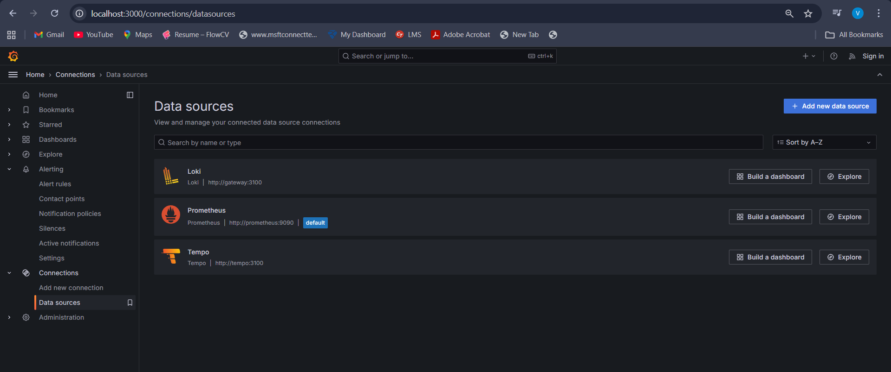
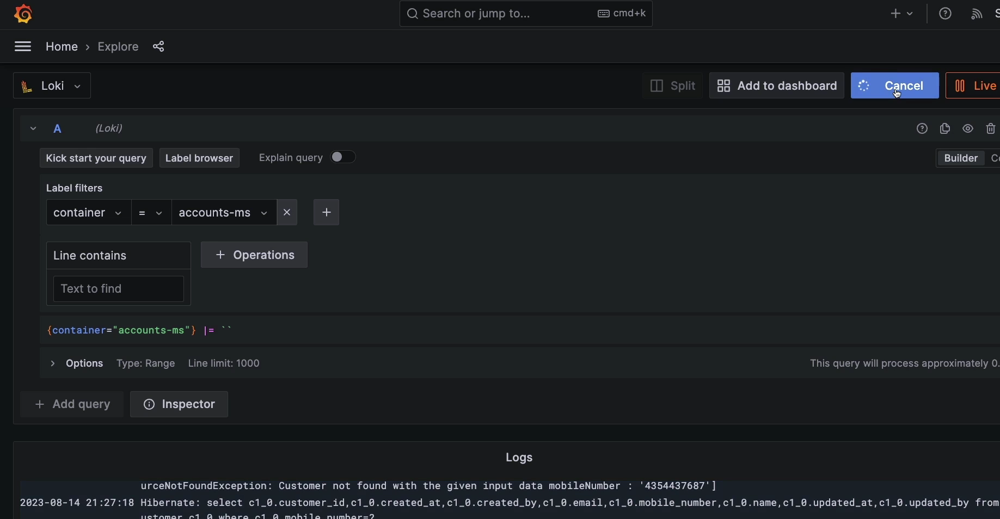
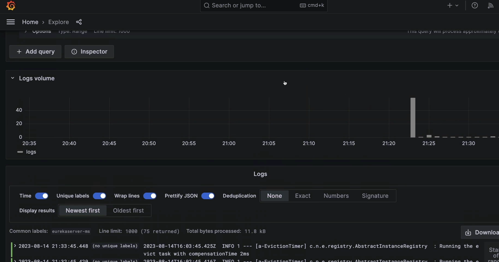
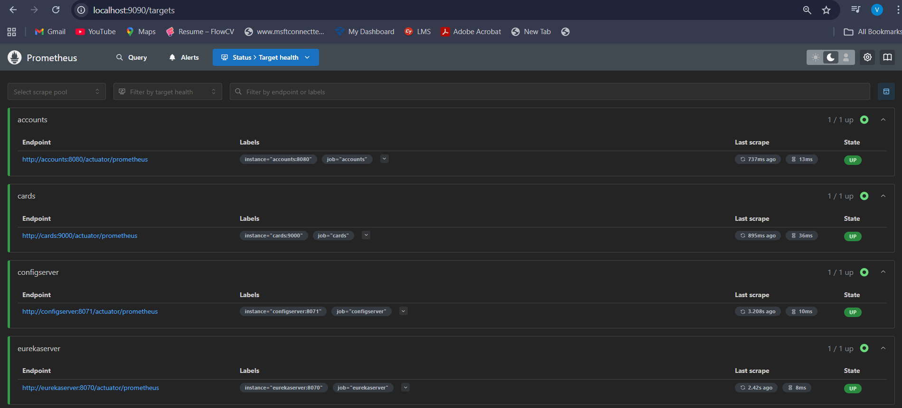
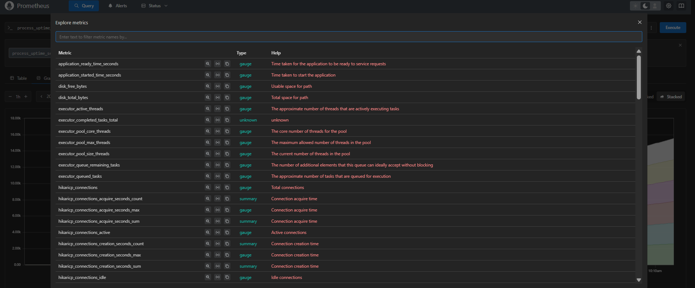
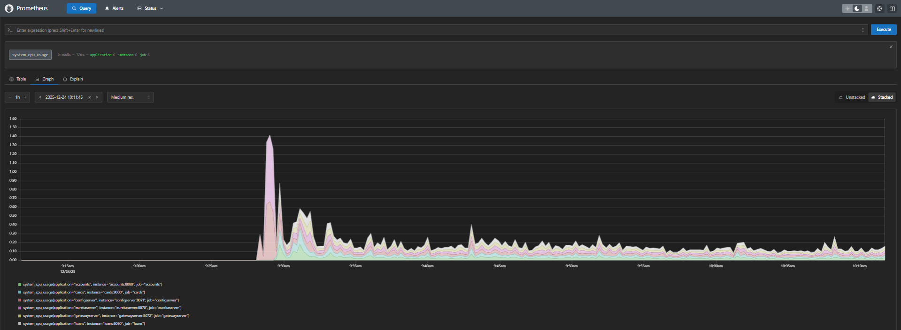
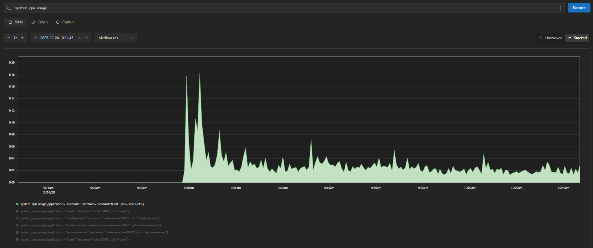
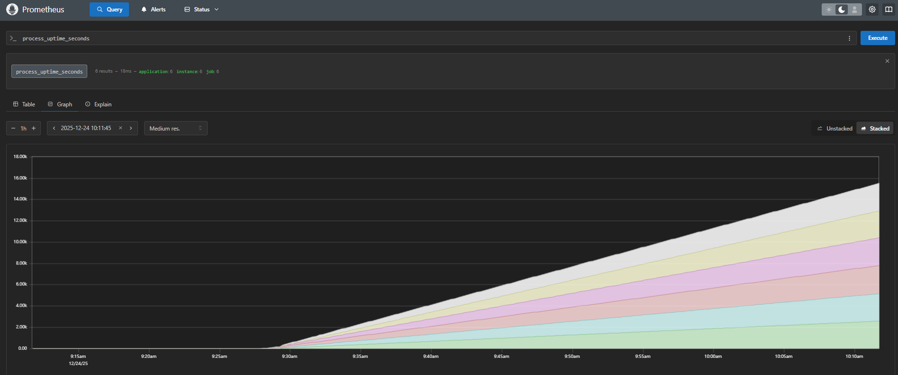
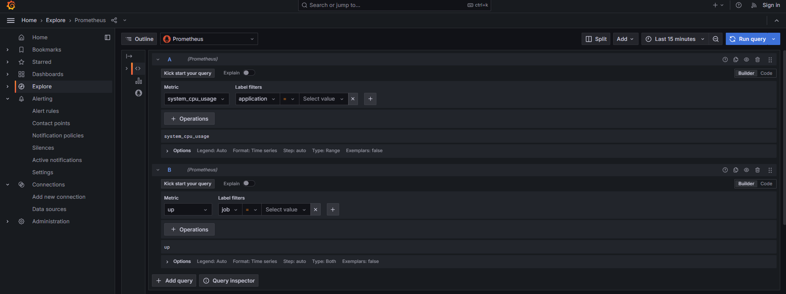

# 🔍 Observability and Monitoring in EazyBank Microservices

This section represents an **advanced evolution** of the EazyBank microservices architecture, where the focus shifts from **resiliency** to **deep visibility, performance insights, and proactive system health management**.

By adding **observability and monitoring**, the system becomes easier to **debug, analyze, and operate in production**.

---

## 🚧 Challenges We Are Solving

### 1️⃣ Hard to Identify Failures

**Problem:**
When something breaks in a microservices system, it becomes difficult to know:
- ❓ Which service failed
- ❓ Where exactly the bug occurred
- ❓ How the request traveled across multiple services

**Solution (Observability):**
Collect and combine:
- 📄 Logs from all services
- 🧩 Centralize logs in one place
- 🔎 Make logs searchable

This allows developers to **quickly trace issues and identify root causes**.

---

### 2️⃣ Monitoring Performance of Service Calls

**Problem:**
You need visibility into:
- ⏱️ How long each service takes to respond
- 🐌 Where the request became slow
- 🚫 Which service is the bottleneck

**Solution (Observability + Tracing):**
- Track the **entire request journey** across services
- Measure:
  - Latency
  - Response time
  - Failures

This is achieved using **distributed tracing tools**.

---

### 3️⃣ Monitoring Service Metrics & Health

**Problem:**
In production, you must constantly monitor:
- 🧠 CPU usage
- 🧵 JVM memory usage
- 💽 Disk usage
- ❌ Error rates
- ❤️ Health of every microservice

**Solution (Monitoring):**
Use monitoring tools to:
- 📊 Show real-time dashboards
- 🚨 Trigger alerts when thresholds are crossed
- 📢 Notify teams **before outages occur**

---

> **Observability + Monitoring together help identify and resolve issues in microservices *before* they impact users or cause outages.**

---

## 👀 What Is Observability?

### 📘 Definition

**Observability** is the ability to **understand the internal state of a system by analyzing the data it produces**, such as logs, metrics, and traces, without modifying the system itself.

In microservices, observability answers:
- *Why* did this failure happen?
- *Where* did the latency occur?
- *How* did a request flow through services?

Observability focuses on **unknown and unexpected problems**.

---

## 🧱 Three Pillars of Observability

### 1️⃣ Metrics 📊

**What they are:**
- Numerical measurements collected over time

**Examples:**
- Request count
- Response time
- Error rate
- CPU & memory usage

**Why they matter:**
- Help detect trends
- Enable alerting
- Provide high-level system health

---

### 2️⃣ Logs 📄

**What they are:**
- Timestamped, structured or unstructured event records

**Examples:**
- Error messages
- Debug information
- Business events

**Why they matter:**
- Help debug issues
- Provide detailed context
- Useful for root cause analysis

---

### 3️⃣ Traces 🧭

**What they are:**
- End-to-end view of a request as it flows through multiple services

**Includes:**
- Service-to-service hops
- Time spent in each service
- Failures and delays

**Why they matter:**
- Identify performance bottlenecks
- Understand request flow
- Debug distributed systems

---

## 📡 What Is Monitoring?

### 📘 Definition

**Monitoring** is the practice of **collecting, visualizing, and alerting on predefined system metrics and health indicators** to ensure systems are operating within expected limits.

Monitoring focuses on **known problems** and system stability.

---

### 🎯 Why Monitoring Is Important in Microservices

- 🔄 Detect service downtime early
- 📈 Track resource usage trends
- 🚨 Alert teams before failures escalate
- 📊 Ensure SLAs and performance goals
- 🧠 Maintain operational confidence

---

## 🔍 Observability vs Monitoring

| Aspect | Observability | Monitoring |
|------|--------------|------------|
| Purpose | Understand *why* something happened | Detect *when* something is wrong |
| Focus | Unknown & complex issues | Known issues |
| Data | Logs, Metrics, Traces | Mostly Metrics |
| Scope | Deep system behavior | System health |
| Debugging | Root cause analysis | Alert-based investigation |
| Reactive / Proactive | Proactive insights | Mostly reactive |
| Usage | Developers & SREs | Ops & Support teams |

---
## 📝 Logging in EazyBank Microservices

Logging is a **core foundation** of observability. Before metrics and traces, logs are usually the **first signal** that something is wrong in a system.

---

## 📘 What Is Logging?

### 🔍 Detailed Definition

**Logging** is the process of **recording events, messages, and contextual information** produced by an application while it is running.

In microservices, logging helps answer questions like:
- What happened?
- When did it happen?
- In which service did it happen?
- What was the request or error context?

Logs act as a **historical record of system behavior**, making them essential for:
- Debugging issues
- Root cause analysis
- Auditing and compliance
- Understanding runtime behavior

In distributed systems like microservices, logs must be:
- **Centralized**
- **Searchable**
- **Correlated across services**

Without centralized logging, debugging becomes extremely difficult.

---

## 📊 Log Levels Explained

Log levels define the **severity and importance** of log messages.

### 1️⃣ TRACE 🧵
- Most detailed level
- Used for **very fine-grained debugging**
- Shows method-level or step-by-step execution
- Typically disabled in production

---

### 2️⃣ DEBUG 🐞
- Used for debugging during development
- Shows internal application state
- Helps developers understand logic flow

---

### 3️⃣ INFO ℹ️
- General application events
- Indicates normal system behavior
- Commonly enabled in production

---

### 4️⃣ WARN ⚠️
- Indicates potential problems
- System continues to work but something looks abnormal

---

### 5️⃣ ERROR ❌
- Serious issues that caused a failure
- Requires immediate attention

---

## 🧠 Why Centralized Logging Is Needed

In a microservices architecture:
- Each service runs independently
- Each service generates its own logs
- Logs are spread across multiple containers/VMs

👉 **Centralized logging** solves this by:
- Collecting logs from all services
- Storing them in one place
- Making them searchable and filterable

---

## 📦 Managing Logs with Grafana Stack

EazyBank uses the **Grafana Observability Stack** for logging:
- **Grafana** → Visualization & querying
- **Loki** → Log storage & indexing
- **Alloy** → Log collection & forwarding

---

## 📊 Grafana (Visualization Layer)

### 📘 What Is Grafana?

**Grafana** is an **open-source observability and visualization platform** used to explore, query, and visualize logs, metrics, and traces.

Grafana provides:
- Interactive dashboards
- Powerful query capabilities
- Unified view of observability data

### 🎯 Role of Grafana in Logging

- Connects to Loki as a data source
- Displays logs in real time
- Allows filtering by:
  - Service name
  - Log level
  - Time range
- Helps developers quickly identify issues

Grafana acts as the **single pane of glass** for observability.

---

## 🗄️ Loki (Log Storage Layer)

### 📘 What Is Loki?

**Grafana Loki** is a **log aggregation and storage system** designed specifically for cloud-native and microservices environments.

Unlike traditional log systems:
- Loki does **not index full log content**
- It indexes only **metadata (labels)**

### 🧠 Why Loki Is Efficient

- Lower storage cost
- Faster ingestion
- Scales easily with microservices

### 🎯 Role of Loki

- Receives logs from Alloy
- Stores logs efficiently
- Indexes logs using labels like:
  - service name
  - environment
  - log level

Loki is optimized for **high-volume, low-cost log storage**.

---

## 🚚 Alloy (Log Collector)

### 📘 What Is Alloy?

**Grafana Alloy** is a **unified telemetry collector** used to collect and forward:
- Logs
- Metrics
- Traces

(Alloy is the modern evolution of Promtail.)

### 🎯 Role of Alloy in Logging

- Runs alongside microservices
- Reads logs from:
  - Application files
  - Containers
  - Standard output
- Adds labels (service name, instance, env)
- Sends logs to Loki

Alloy acts as the **bridge between microservices and Loki**.

---

## 🔄 Logging Flow in EazyBank

### 🧩 End-to-End Log Flow

1️⃣ **Microservices generate logs**  
Each service (Accounts, Loans, Cards, Gateway) writes logs during execution.

2️⃣ **Alloy collects the logs**  
Alloy reads logs, enriches them with metadata, and prepares them for storage.

3️⃣ **Loki stores the logs**  
Loki receives logs from Alloy and stores them efficiently using labels.

4️⃣ **Grafana displays the logs**  
Grafana queries Loki and displays logs in a searchable, visual format.

---

## 🔁 Logging Architecture Flow

```text
Microservices
      ↓
   Grafana Alloy
      ↓
      Loki
      ↓
   Grafana UI

```
---
## 📸 Logging & Observability – Implementation Screenshots

The following screenshots demonstrate the **successful setup and verification of centralized logging and observability** in the EazyBank microservices using **Grafana + Loki**.

---

## 🧩 Grafana Data Sources Configuration

### 📊 Grafana – Connected Data Sources

This screenshot shows the **Grafana Data Sources page**, confirming that all required observability components are properly connected.

It verifies the successful integration of:
- **Loki** → Log aggregation
- **Prometheus** → Metrics collection
- **Tempo** → Distributed tracing

This ensures that Grafana can visualize **logs, metrics, and traces** from the microservices ecosystem.



---

## 🔍 Logs Exploration Using Loki (Accounts Service)

### 🧾 Grafana Explore – Loki Logs (Accounts Service)

This screenshot is taken from **Grafana → Explore section**, where:
- **Loki** is selected as the data source
- Logs for the **Accounts microservice** are queried
- Real-time application logs are visible and searchable

This confirms that:
- Logs are successfully collected by Alloy
- Stored in Loki
- Queried and displayed through Grafana



---

## 📈 Log Visualization & Activity Chart

### 📉 Loki Log Volume & Activity Chart (Accounts Service)

This screenshot shows the **log activity chart** under the Loki data source for the Accounts service.

It visually represents:
- Log frequency over time
- Spikes in log generation
- Correlation between application activity and logs

This helps in:
- Identifying peak load periods
- Detecting abnormal behavior
- Understanding service runtime patterns



---

## ✅ What These Screenshots Prove

- ✔️ Grafana is correctly configured with all observability data sources  
- ✔️ Loki is successfully ingesting and storing logs  
- ✔️ Logs from microservices are centralized and searchable  
- ✔️ Developers can visually analyze logs and system behavior  

📌 **These screenshots validate the complete logging pipeline:  
Microservices → Alloy → Loki → Grafana**

---

## 📊 Metrics & Monitoring in EazyBank Microservices  
### Using Spring Boot Actuator, Micrometer, Prometheus & Grafana

## ❓ Why Do We Need Metrics & Monitoring?

In a microservices-based system, applications are:
- Distributed across multiple services
- Deployed independently
- Scaled dynamically
- Running inside containers or cloud environments

Without proper monitoring, it becomes very difficult to answer critical questions such as:
- Is my service healthy right now?
- How much CPU or memory is it using?
- Is response time increasing?
- Are error rates going up?
- Will the system handle increased traffic?

### 🚨 Problems Without Monitoring
- Failures are detected **too late**
- Performance bottlenecks go unnoticed
- No visibility into system health
- No data to plan scaling or capacity
- Difficult troubleshooting during incidents

### ✅ Solution: Metrics & Monitoring
Metrics and monitoring provide **real-time insights** into application behavior and system health, allowing teams to:
- Detect issues early
- Analyze performance trends
- Prevent outages
- Make data-driven decisions

---

## 🌡️ What Is Micrometer?

**Micrometer** is a **metrics instrumentation library** for Java applications and is the **default metrics facade used by Spring Boot**.

It acts as a **bridge between Spring Boot applications and monitoring systems** like:
- Prometheus
- Grafana
- Datadog
- New Relic

### 🔍 Why Do We Use Micrometer?

- It provides a **vendor-neutral API** for metrics
- Automatically instruments:
  - JVM metrics
  - CPU usage
  - Memory usage
  - Thread pools
  - HTTP request metrics
- Seamlessly integrates with **Spring Boot Actuator**
- Makes it easy to export metrics to Prometheus

👉 In simple terms:
> **Micrometer collects application metrics and exposes them in a format that monitoring tools can understand.**

---

## 📡 What Is Prometheus?

**Prometheus** is an **open-source monitoring and alerting system** designed for **cloud-native and microservices architectures**.

It works on a **pull-based model**, where Prometheus periodically **scrapes metrics** from applications and infrastructure endpoints.

### 🔑 Key Characteristics of Prometheus

- Pull-based metrics collection
- Time-series database (TSDB)
- Powerful query language (**PromQL**)
- Service discovery support (Docker, Kubernetes)
- Built-in alerting mechanism
- Tight integration with Grafana

Prometheus is especially well-suited for:
- Dynamic microservices environments
- Containerized applications
- Cloud-native systems

---

## 🎯 Main Uses of Prometheus

### 1️⃣ Monitoring System Performance
Prometheus tracks:
- CPU usage
- Memory usage
- JVM heap and non-heap memory
- Thread count
- Garbage collection activity

This helps identify performance bottlenecks early.

---

### 2️⃣ Alerting
Prometheus can trigger alerts when:
- CPU or memory crosses thresholds
- Error rates spike
- Services become unavailable

Alerts can be sent to tools like:
- Alertmanager
- Slack
- Email
- PagerDuty

---

### 3️⃣ Prometheus & Docker Monitoring
Prometheus can monitor:
- Docker containers
- Container resource usage
- Application instances running inside containers

This is critical for microservices deployed using Docker.

---

### 4️⃣ Application Monitoring
Prometheus monitors application-level metrics such as:
- HTTP request count
- Response time
- Error rates
- Endpoint performance

These metrics come directly from **Spring Boot Actuator + Micrometer**.

---

### 5️⃣ Capacity Planning
By analyzing historical metrics, teams can:
- Predict future load
- Plan scaling strategies
- Decide when to add resources

This avoids over-provisioning or under-provisioning.

---

### 6️⃣ Service Health Tracking
Prometheus continuously checks:
- Service availability
- Health endpoints
- Uptime and downtime patterns

This ensures proactive monitoring instead of reactive firefighting.

---
### 🔄 Metrics & Monitoring Flow:

**Step 1: Spring Boot Actuator – Data Exposer**  
Spring Boot Actuator exposes internal application data such as health status, JVM metrics, HTTP request statistics, and system information through standardized endpoints.

**Step 2: Micrometer – Metrics Translator**  
Micrometer collects these metrics from the application and translates them into a monitoring-system–friendly format, acting as a bridge between Spring Boot and Prometheus.

**Step 3: Prometheus – Metrics Collector & Storage**  
Prometheus periodically scrapes the exposed metrics from applications, stores them as time-series data, and makes them available for querying and alerting.

**Step 4: Grafana – Dashboard & Visualization**  
Grafana reads metrics from Prometheus and presents them as interactive dashboards, graphs, and charts, giving teams clear visibility into system performance and health.

---


## 📊 Prometheus Dashboards – Metrics Visualization (Screenshots)

The following screenshots demonstrate how **Prometheus** is used to monitor EazyBank microservices by accessing: 
http://localhost:9090/prometheus/targets


Each image highlights a specific capability of Prometheus dashboards and metrics exploration.


### 🖼️ Screenshot 1: Prometheus Targets & Health Status  

**Description:**  
This screenshot shows the **Status → Targets** page in Prometheus.  
Here, all registered scrape targets are listed along with their **health status**.



---

### 🖼️ Screenshot 2: Metrics Explorer – All Available Metrics  

**Description:**  
This screenshot shows the **Metrics Explorer**, where Prometheus lists **all available metrics** collected from applications and infrastructure.



---

### 🖼️ Screenshot 3: System CPU Usage – All Services  

**Description:**  
In this screenshot, the metric **`system_cpu_usage`** is selected and visualized as a graph.



---

### 🖼️ Screenshot 4: System CPU Usage – Accounts Service  

**Description:**  
This screenshot focuses specifically on the **Accounts microservice**, filtering the CPU usage metric for that service only.



---

### 🖼️ Screenshot 5: Process Uptime Seconds  

**Description:**  
This screenshot visualizes the metric **`process_uptime_seconds`**, which shows how long each service instance has been running.



---

## 📊 Observability Screenshots – Grafana & Prometheus (Explore View)


### 🔹 System CPU Usage – All Services
Shows CPU usage across all microservices using Prometheus as data source in Grafana Explore.


---

### 🔹 Combined Metrics Graph (CPU Usage + Service Status)
Combined graph using two Prometheus queries:
- `system_cpu_usage`
- `up`

This helps correlate **system performance** with **service availability**.




---


---
## ✅ Outcome of Metrics & Monitoring Integration

By integrating **Spring Boot Actuator + Micrometer + Prometheus + Grafana**, EazyBank microservices gain:

- 📊 Real-time visibility into system health
- 🔍 Deep insights into application performance
- 🚨 Early detection of failures
- 📈 Data-driven capacity planning
- 🛠️ Faster troubleshooting and incident resolution

🚀 **This makes the EazyBank microservices platform observable, monitorable, and production-ready**

